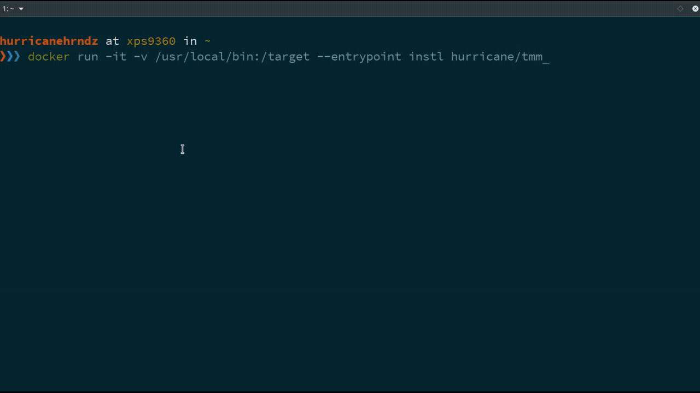

#  tinyMediaManager

- [Quick Start](#quick-start)
- [Description](#description)
- [What is in this image?](#what-is-in-this-image-?)
- [Supported Architectures](#supported-architectures)
- [Contributing](#contributing)
- [Issues](#issues)
- [Installation](#installation)
    - [Install as current user](#install-as-current-user)
    - [Install as other user](#install-as-other-user)
    - [Install from GitHub](#install-from-github)
    - [Initial Configuration](#initial-configuration)
    - [Adding more Volumes](#adding-more-volumes)
- [Maintenance](#maintenance)
  - [Upgrading](#upgrading)
  - [Automatic Upgrades](#automatic-upgrades)
  - [Removal](#removal)
  - [Shell Access](#shell-access)
  - [List Running processes](#list-running-processes)
- [Technical Information](#technical-information)
  - [Environment Variables](#environment-variables)
     - [Adjusting Variables](#adjusting-variables)
  - [Volumes](#volumes)
  - [Manual Run](#manual-run)
  - [XMLRPC Interface](#xmlrpc-interface)
- [License](#license)
- [Donation](#donation)

## Quick Start:

```
docker run -v /usr/local/bin:/target --entrypoint instl hurricane/tmm
tmm --gui
```

## Description:
tinyMediaManager (http://www.tinymediamanager.org) is a media management tool
written in Java/Swing.  It is written to provide metadata for the XBOX Media
Center (XBMC).  Due to the fact that it is written in Java, tinyMediaManager
will run on Windows, Linux and Mac OSX (and possible more OS).

This Docker image makes it possible to use "tinyMediaManager" on a headless
server via xmlrpc. Additionally, on systems with an X-Server running one can use
the GUI.

This subfolder contains all files directly related in building
a [Docker](https://www.docker.com/) image for
[tinyMediaManager](https://github.com/tinyMediaManager/tinyMediaManager).

## What is in this image:

This image is built from the official tinyMediaManager release. Additionally,
it includes an xmlrpc server. The xmlrpc server includes a subset of the
commands provided by tinyMediaManagerCMD.

## Supported Architecutres:

amd64, x86_64, arm32v7, arm64v8

## Contributing

1. Fork it!
2. Create your feature branch: `git checkout -b my-new-feature`
3. Commit your changes: `git commit -am 'Add some feature'`
4. Push to the branch: `git push origin my-new-feature`
5. Submit a pull request :D

## Issues

Before reporting your issue please try updating Docker to the latest version
and check if it resolves the issue. Refer to the Docker [installation
guide](https://docs.docker.com/installation) for instructions.

SELinux users should try disabling SELinux using the command `setenforce 0` to
see if it resolves the issue.

If the above recommendations do not help then [report your
issue](../../issues/new) along with the following information:

- Output of the `docker version` and `docker info` commands
- The `docker run` command or `docker-compose.yml` used to start the image.
  Mask out the sensitive bits.
- Please state if you are using [Boot2Docker](http://www.boot2docker.io),
  [VirtualBox](https://www.virtualbox.org), etc.

## Installation:
It is recommended you install directly from the [Docker
Hub](https://hub.docker.com/r/hurricane/tmm/).

The installation process and scripts are very versatile and can be adjusted by
passing the right combination of variables and arguments to each of the
commands.

The following examples should cover most scenarios. In each scenario, a wrapper
script will be installed on the host that should ease creation and management
of the containerized application. When executing the script it will create
a container named `tmm`. Additionally, the script will ensure that this
container gets setup with the appropriate environment variables and volumes
each time it is executed.

#### Install as current user:
Start the installation by issuing the following command from within a terminal:
```sh
docker run -it --rm -v /usr/local/bin:/target \
    --entrypoint instl
    hurricane/tmm
```

Optionally, you can also install a systemd service file by executing:
```sh
docker run -it --rm -v /etc/systemd/system:/target  \
    --entrypoint instl
    hurricane/tmm service
```

To enable the systemd service for `tmm` execute the following:
```sh
sudo systemctl enable tmm@${USER}
```

#### Install as another user:
In the following instructions adjust each command replacing `username` with the
name of the user you wish to install and run the container as.

To install the application execute and, again, adjust the command replacing
`username` accordingly.
```sh
docker run -it --rm -v /usr/local/bin:/target \
    -e "APP_USER=username" \
    --entrypoint instl
    hurricane/tmm
```

Note, if the user is a system account, the command will need further
adjustment. This is because by default the script stores settings and
configuration in a hidden folder within the executing user's home directory.
This can be overridden by passing the appropriate environment variable
(`APP_CONFIG`) to the `instl` script, such as in the example below:
```sh
docker run -it --rm -v /usr/local/bin:/target \
    -e "APP_USER=username" \
    -e "APP_CONFIG=/var/lib/tmm" \
    --entrypoint instl
    hurricane/tmm
```

### [Install from GitHub](https://github.com/hurricane/docker-containers/tmm):
Installation from GitHub is recommended only for the purposes of
troubleshooting and development. To install from GitHub execute the
following:
```sh
git clone https://github.com/hurricane/docker-containers
cd docker-containers
./build.sh tmm
```

Then proceed by following any of the docker run commands described in the
installation instructions above.

### Initial Configuration:

Once the tinyMediaManager wrapper script (tmm) for docker has been installed
you just need to execute the wrapper script from within a terminal session:
```sh
tmm
```
On the first run the wrapper script will prompt for system paths that
you wish made accessible from within the container. Enter one path per line.

#### Adding more volumes:
Volumes which should be mounted within the container at runtime are kept in the
volume configuration file found under the `APP_CONFIG` folder on the host. The
location will vary depending on the type of installation.

If the wrapper script was installed as the executing user the volume
configuration file can be found at:
`${HOME}/.config/tmm/.tmm.volumes`
Otherwise at:
`${APP_CONFIG}/.tmm.volumes`

## Maintenance

### Upgrading:

You can upgrade the version of tinyMediaManager (tmm) found within the
container by executing one of the following commands:
```sh
tmm --update
```

Or by executing:
```sh
docker exec tmm update
```

You can update the container itself by executing:
```sh
docker pull hurricane/tmm
docker stop tmm
tmm --gui
```

### Automatic Upgrades:

If you wish the docker container to automatically update upon creation, set the
environment variable `EDGE` to `1`. Please read the `Technical Details` section
for the various ways this can be achieved.

In order to have the container periodically check and upgrade tinyMediaManager
one can add  a [`crontab`](https://en.wikipedia.org/wiki/Cron) entry. Like so:
```
echo "0 2 * * * docker exec tmm update" | sudo tee -a /var/spool/cron/crontabs/root
```
or
```
echo "0 2 * * * tmm --update" | sudo tee -a /var/spool/cron/crontabs/root
```
### Removal:

```bash
docker run -it --rm \
  --volume /usr/local/bin:/target \
  --entrypoint uninstl
  hurricane/tmm
```

### Shell Access:

For debugging and maintenance purposes you may want access the container's
shell. If you are using Docker version `1.3.0` or higher you can access
a running container's shell by starting `bash` using `docker exec`:

```sh
tmm --console
```
or
```sh
docker exec -it tmm bash
```

### Logs:
```sh
tmm --logs
```

### List running processes:
```sh
tmm --status
```

## Technical information:

By default the containerized application has been set to run with UID and GID
`1000`. If using the automatic install method from Docker, the container is set
to run with the UID and GID of of the user executing the `tmm` wrapper
script.  Additionally, the wrapper script saves tmm's configuration and
settings in a hidden sub folder in the executing user's home directory. Most
default settings can be adjusted by passing the appropriate environment
variable. Here is a list of any and all applicable environment variables that
can be override by the end user.

### Environment Variables:

You can adjust some of the default settings set for container/application by
passing any or all of the following environment variable:

| ENV VAR        | Definition                                                                     |
| -------------- | ------------------------------------------------------------------------------ |
| APP_USER       | Name of user the service will run as.\[4\]                                     |
| APP_UID        | UID assigned to APP_USER upon creation, or will query APP_USER's ID.\[3\]      |
| APP_GID        | GID assigned to APP_USER upon creation, or will query APP_USER's GID.\[3\]     |
| APP_CONFIG     | Location where application will store settings and database on host.\[1\]      |
| APP_GUEST_CFG  | Location where application will store settings and database within guest.\[4\] |
| APP_PORT       | App's Web UI port used to configure and access the xmlrpc service.\[2\]        |
| UMASK          | umask assigned to service, default set to 002.\[4\]                            |
| EDGE           | Update the containerized service, default set to 0(Off).\[4\]                  |

\[1\]: Variable is applicable only during install.  
\[2\]: Variable is applicable during install, when invoking installed wrapper script or systemd service.  
\[3\]: Variable is applicable only when invoking docker run directly.  
\[4\]: Variable is applicable in all scenarios.  

#### Adjusting Variables:

In order to pass any of the applicable variables during install or when
invoking `docker run` directly  please read Docker's documentation on
[environment
variables](https://docs.docker.com/engine/reference/run/#env-environment-variables)
for clarification. Otherwise, the following examples should be pretty clear.

The following examples will use the environment variable `EDGE`. `EDGE` has
been chosen since it is applicable during all scenarios.

To pass the `EDGE` variable while invoking `docker run` append the following
prior to the image name. Any and all other applicable variables can be done in
the same manner.
```sh
--env=EDGE=1
```

To pass the environment variable during the other scenarios do so like in one
of the examples below:

From the commandline when calling the wrapper script:
```
EDGE=1 tmm
```

By adjusting the systemd service:
```ini
[Service]
Type=simple
Environment=EDGE=1
...
```

### Volumes:

* `/opt/tmm/data`   - Folder for configuration and settings.
* `/opt/tmm/cache`  - Folder for tinyMediaManager image cache.
* `/opt/tmm/backup` - Folder for tinyMediaManager backups.
* `/opt/tmm/logs`   - Folder for tinyMediaManager logs.


### Manual Run:

Of course you can always run the docker image manually. Please be aware that if
you wish your data to remain persistent you need to provide a location for the
for all the exposed volumes. For example,
```
docker run -d --net=host
    -v /*your_config_location*:/opt/tmm/data \
    -v /*your_cache_location*:/opt/tmm/cache \
    -v /*your_backup_location*:/opt/tmm/backup \
    -v /*your_log_location*:/opt/tmm/logs \
    -e TZ=America/Edmonton
    --name=tmm hurricane/tmm
```
All the information mention previously regarding user UID and GID still applies
when executing a docker run command.

### XMLRPC Interface:

First of all, the XMLRPC is not harden for internet use. A example script can
be found in the examples directory within this project's folder.


## License

Code released under the [MIT license](../LICENSE).


## Donation
[@hurricanehrndz](https://github.com/hurricanehrndz): [](https://www.paypal.com/cgi-bin/webscr?cmd=_s-xclick&hosted_button_id=74S5RK533DD6C)
